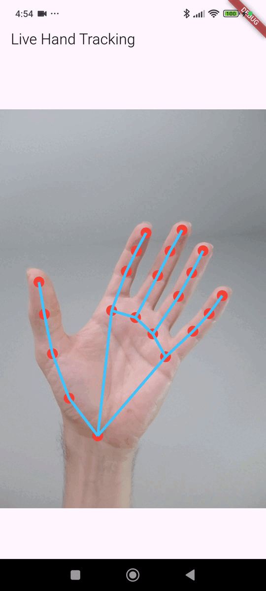

 Hand Landmarker - Example Application



This directory contains a working Flutter application that demonstrates the functionality of the `hand_landmarker` plugin.

## Purpose

The purpose of this example app is to provide a complete, runnable demonstration of the plugin's capabilities, including:

-   Initializing the plugin.
-   Processing a live camera feed from the `camera` package.
-   Receiving hand landmark data from the plugin.
-   Rendering the results to the screen using a `CustomPainter`.

It serves as a practical reference for developers using the `hand_landmarker` plugin in their own applications.

## How to Run This Example

1.  **Navigate to the example directory:**
    ```bash
    cd example
    ```

2.  **Install dependencies:**
    ```bash
    flutter pub get
    ```

3.  **Run the app on a connected Android device or emulator:**
    ```bash
    flutter run
    ```

---

For documentation on the plugin's API and how to integrate it into your own project, please see the `README.md` file in the parent directory.

